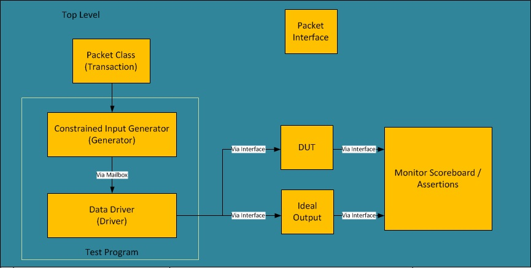

# system verilog / verification methology
System Verilog Presentation / example code I wrote to use as a template for future test benches.

Demonstrates very basic system verilog features which can be tied together for a constrained random testbench.

